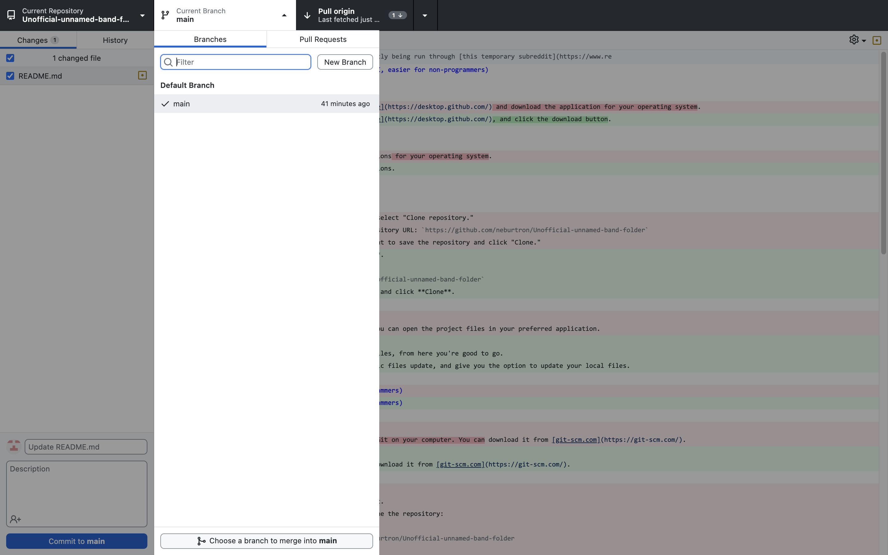
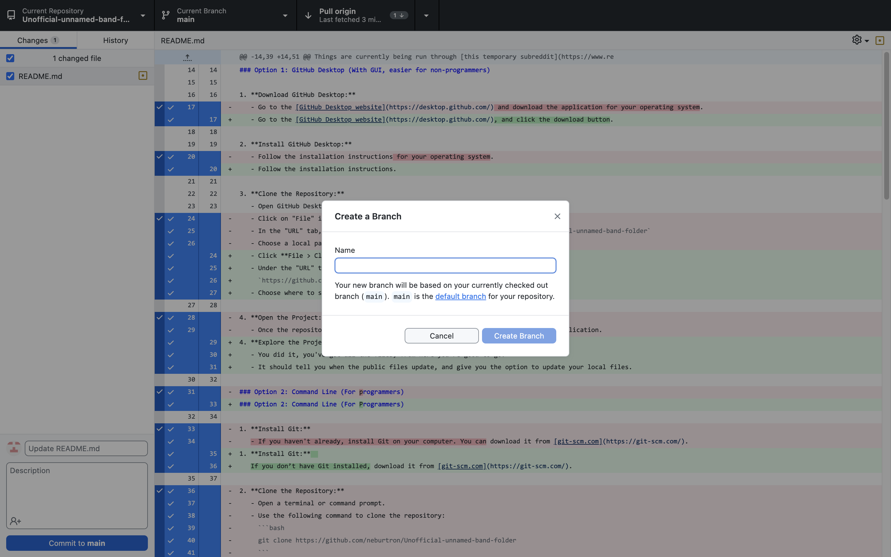
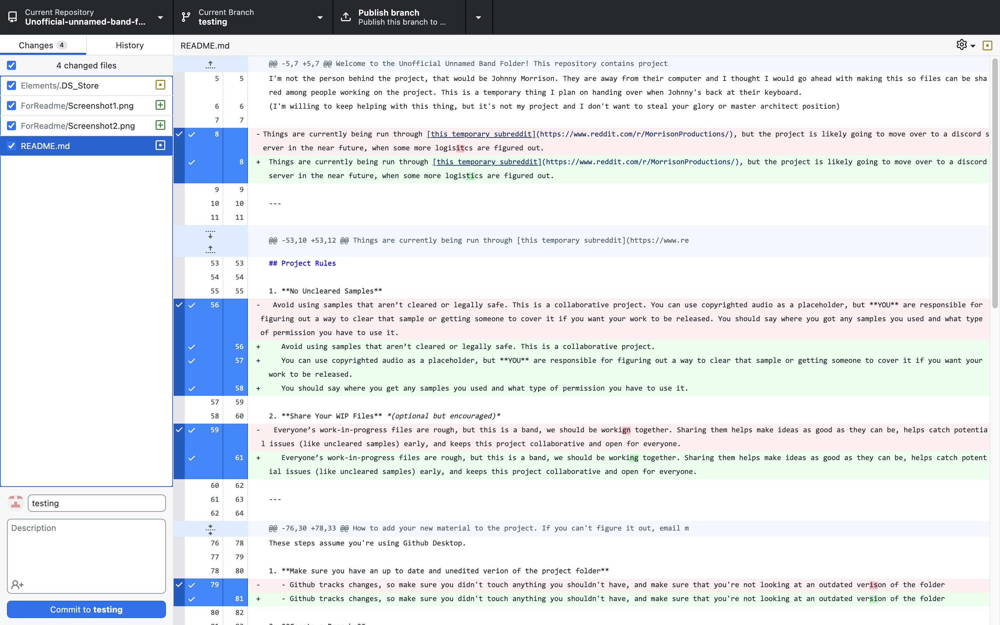

# Email-band-folder

Welcome to the Email Band Public Folder! This repository contains music files for this project anyone can play with and add to. I'm telling you right now, GitHub isn't hard to use, there's a web app, just look at how short the instructions are.

This document tells you how to download the project folder onto your device, and how to add to the project. For info about the organization of this project folder, [click here](structure.md).

The GitHub page is currently maintained by me, Ru Baton. Johnny Morrison is the mastermind behind this project, and the Discord Server has been worked on by Lu and Unkempt.

Things are currently being run through [this temporary subreddit](https://www.reddit.com/r/MorrisonProductions/)

The Official Discord has also just been released [here](https://discord.com/invite/aM83vrDN)!

---

## How to Download

1. **Download GitHub Desktop:**
   - Go to the [GitHub Desktop website](https://desktop.github.com/), and click the download button.

2. **Install GitHub Desktop:**
   - Follow the installation instructions.

3. **Clone the Repository:**
   - Open GitHub Desktop.
   - Click **File > Clone repository**.  
   - Under the "URL" tab, paste:  
     `https://github.com/neburtron/Unofficial-unnamed-band-folder`  
   - Choose where to save the project and click **Clone**.

4. **Explore the Project:**  
   - You did it, you've got all the files, from here you're good to go.
   - It should tell you when the public files update, and give you the option to update your local files.

---

## Project Rules  

1. **No Samples**  
   I'm sorry, but it's just not feasable for this project. This is a public open source project, if you use copyrighted material and we don't catch it, the project suffers. At this point, we're not allowing the use of samples unless they're clearly in the public domain or free to use without limitation, there's zero risk to some weird misunderstanding, and you go through to make sure it's ok and write out a txt file about where you got it and how you know it's ok to use.
   You can still release anything you want under your own name, and work with people you meet through the Email Band on whatever you want.

---

## Contribution Guidelines

How to add your new material to the project. If you can't figure it out, email me (Ru Baton, email at bottom of this page), send me the files and I can add it for you.

1. **Make sure you have an up to date and unedited verion of the project folder**
   - Github tracks changes, so make sure you didn't touch anything you shouldn't have, and make sure that you're not looking at an outdated version of the folder.

2. **Create a Branch:**
   - Create a new branch by opening this menu and clicking this new branch.

3. **Name it:**

4. **Make Changes:**
   - Make whatever changes you want made.

5. **Commit Changes:**
   - Commit your changes in the bottom left

6. **Push Changes:**
   - Push your changes to your forked repository when it pops up, there's enough screenshots here, you'll see it.

7. **Create a Pull Request:**
   - Open a pull request from your forked repository's branch to the main branch of this repository. If you've gotten this far, you'll be able to figure it out.

Note: I originally had empty folders setup, but GitHub was being weird. I don't know the best way to structure things, so I'm leaving it to you for now. Be organized and try and follow other people's lead. We need something to start with and we can clean things up from there.

## License

This project is under the Creative Commons Licenses (CC BY-NC 4.0), this GitHub is a WIP, I'll formalize this section and add in whatever files later, but that's what I'm going with.

## Contact

Johnny Morrison (God King)
To be Written

Ru Baton (GitHub Maker and maintainer. Not the same person as Johnny)
 I'm MuteMAR / Ru Baton / Neburtron, my email's [MuteMaroonWorm@Gmail.com](mailto:MuteMaroonWorm@Gmail.com). I'm the guy that had the gall to make an unofficial github page for this thing, and I've been given the green light to remove the unofficial from the name.
